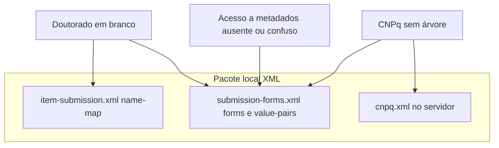

# Diagnóstico da resposta ao TI (forms DSpace)

## Contexto

O repositório contém configuração típica de **DSpace 7** (`DescribeStep`, `submission-forms.xml`, `item-submission.xml`). Abaixo, cada ponto do seu e-mail reconciliado com o que está nos arquivos e **onde costuma estar o erro** (sua config vs. operação do TI).

---

## Estratégia dupla: mapa completo + fallback `traditional` decente

É verdade que **qualquer coleção cujo handle não apareça em** `<submission-map>` usa o processo `**default` → `traditional`** ([item-submission.xml](c:/annakarollina/atualizando_forms/item-submission.xml) ~19–21 e ~527–561). Por isso faz sentido **modelar o traditional como rede de segurança**, além de ir preenchendo os `<name-map>`.

**Estado atual no pacote local:** os formulários `[traditionalpageone](c:/annakarollina/atualizando_forms/submission-forms.xml)` e `[traditionalpagetwo](c:/annakarollina/atualizando_forms/submission-forms.xml)` (~53–234) já estão em português e incluem autor, título, data, tipo, idioma, palavras-chave, resumo (`dc.description.abstract`), fomento (`sponsorship_br`), etc. **Faltam**, em relação ao que o TEDE/instituição costuma exigir nos fluxos específicos:

- `**dc.rights.access`** com dropdown `**ufcat_access_rights**` (quatro valores COAR, incl. metadata-only).
- `**dc.subject.cnpq**` com `<vocabulary>cnpq</vocabulary>` (depende de `cnpq.xml` no servidor).
- Opcional: `**dc.description.resumo**` explícito se quiser separar PT / língua estrangeira como nos formulários de tese (hoje o traditional só usa `abstract` com rótulo “Resumo”).

**Formas de implementar (escolha na fase de execução):**

1. **Estender `traditionalpagetwo`** com novas linhas (direitos + CNPq) — menos XML, páginas mais longas.
2. **Novo passo Describe** (ex.: `traditionalpage_rights` + `<form name="traditionalpage_rights">`) referenciado no `<submission-process name="traditional">` entre `traditionalpagetwo` e `upload` — mantém páginas curtas e agrupa “direitos + vocabulários institucionais” num bloco só.

**Trade-off importante:** o traditional é usado por **qualquer** item genérico (coleções experimentais, documentos administrativos sem mapa, etc.). Campos obrigatórios demais no fallback podem **bloquear depósitos legítimos** que não deveriam passar pelo fluxo completo da pós. Recomendação: no fallback, marcar **CNPq e direitos como obrigatórios só se** a política institucional aceitar que “todo item sem mapa” deve mesmo preencher isso; caso contrário, deixar `required` vazio e usar apenas hints.

**Ordem de prioridade sugerida:** (A) corrigir deploy + `<name-map>` para coleções oficiais; (B) endurecer `traditional` com direitos + CNPq como acima — assim coleções esquecidas no mapa ainda geram metadados mínimos alinhados ao OAI/CAPES.

---

## Evidências homologação (capturas)

1. **Workspace item em edição (`…/workspaceitems/1292/edit`):** a coleção visível é **Mestrado em Modelagem e Otimização – PPGMO**, não “Doutorado em Química – PPGQ”. Ou seja, essa tela valida o fluxo da coleção **PPGMO** (handle esperado no pacote local: `tede/40` → `dissertationProcess`). Se mesmo assim aparecer formulário “tradicional” genérico ou etapa Descrever estranha, o problema é **mapa de submissão no servidor** ou item criado antes da atualização do mapa.
2. **TCC – “Trabalhos de Conclusão de Curso”:** o dropdown **“Selecione a permissão de acesso”** mostra só **três** valores úteis (Acesso aberto, embargado, restrito) — **não** aparece a quarta opção (metadata-only / COAR `c_14cb`). Também **não** aparece o texto longo *“Acesso fechado (closedAccess — ao público só metadados)”* que existe no seu `ufcat_access_rights` local.
  **Interpretação:** não é apenas “nome bonito”; no homolog o bloco `ufcat_access_rights` **é menor ou outro** que o do seu [submission-forms.xml](c:/annakarollina/atualizando_forms/submission-forms.xml). Isso é típico de **arquivo não substituído**, branch diferente no servidor, ou deploy/cache sem reinício.
3. **Área CNPq no TCC:** campo **“Informe a área do CNPq”** aparece como caixa simples — compatível com `**cnpq.xml` ausente no servidor** ou UI sem carregar vocabulário (o XML local declara `<vocabulary>cnpq</vocabulary>` em [submission-forms.xml](c:/annakarollina/atualizando_forms/submission-forms.xml) ~3378–3381).
4. **Título da seção `submission.sections.TCC. Direitos`:** indica **chave i18n não traduzida** no tema/Messages — cosmético para o TI, mas mostra que personalização e configs podem estar **fora de sincrono** com pacote de mensagens.

---

## Doutorado em Química – PPGQ — handle confirmado

- URI permanente homolog: `https://repositorio.homolog.ufcat.edu.br/handle/tede/68`
- No pacote local, [item-submission.xml](c:/annakarollina/atualizando_forms/item-submission.xml) contém explicitamente:

```xml
<name-map collection-handle="tede/68" submission-name="thesisProcess"/>
```

Ou seja: **na sua versão dos XMLs, você não “esqueceu” o PPGQ** — o fluxo esperado é `thesisProcess` com formulários `ufcatthesis_step1`–`ufcatthesis_step5`. Se no homolog o depósito em **tede/68** ainda cai no processo `traditional` ou em Describe vazio, a hipótese dominante é `**item-submission.xml` do servidor ≠ seu arquivo** (ou serviço não reiniciado após cópia).

O mesmo raciocínio vale para **“outras coleções”** que você vê com formulário tradicional péssimo: todo handle que **não** está no `<submission-map>` cai no `default` → processo `traditional` em [item-submission.xml](c:/annakarollina/atualizando_forms/item-submission.xml) linha ~21.

---

## 1. “Forms do doutorado em branco”

**O que o arquivo faz:** Os fluxos de tese usam os passos `ufcatthesis_step1` … `ufcatthesis_step5`, e existem formulários com esses nomes em [submission-forms.xml](c:/annakarollina/atualizando_forms/submission-forms.xml) (por volta das linhas 1993–2259). Ou seja, **no pacote local não há indício de formulário de tese vazio por ausência de `<form>`**.

**Causas mais prováveis (geralmente não é “sumiu do XML”):**

- `**collection-handle` no mapa não bate com o ambiente.** Em [item-submission.xml](c:/annakarollina/atualizando_forms/item-submission.xml) as coleções de doutorado usam o processo único `thesisProcess` (handles `tede/61`, `tede/68`, `123456789/11949`, `123456789/12035`). Coleções novas ou handles diferentes em produção caem no `**default`** (`traditional`) — a interface pode parecer “errada” ou vazia conforme o passo/tema.
- **Deploy parcial ou serviço sem reinício:** só `submission-forms.xml` ou só `item-submission.xml` atualizado, XML inválido no servidor, ou **serviço não reiniciado** após copiar configs (comportamento clássico: UI não reflete o esperado).
- **Passo sem `<form>` correspondente:** o `step id` do processo precisa coincidir com o `<form name>` em `submission-forms.xml`; se alguém alterar o processo para um id sem formulário homónimo, a tela fica em branco.

**Como separar culpa config vs. TI:** Para PPGQ já há handle `**tede/68`**. Pedir ao TI que no **servidor homolog** compare byte-a-byte (ou pelo menos grepem) se existe a linha `collection-handle="tede/68"` com `thesisProcess`. Se não existir, **culpa deploy**. Para outras coleções, mesmo procedimento: handle real vs. `<name-map>`.

**Describe “vazio”:** Em DSpace 7, painel sem campos costuma indicar `**<step id>` sem `<form name>` correspondente** em `submission-forms.xml`, ou **processo errado** (traditional). Vale pedir ao TI o **nome do submission process** retornado pela API REST para o workspace item (ou log) — deve bater com `thesisProcess` para tede/68.

---

## 2. Coleções de Matemática Industrial repetidas

Isso é **estrutura do repositório** (duas coleções criadas no DSpace), não algo que [submission-forms.xml](c:/annakarollina/atualizando_forms/submission-forms.xml) “desduplica”. Manter só **“Trabalhos de Conclusão de Curso”** implica:

- Arquivar/remover a coleção duplicada no **admin do DSpace** e garantir que submissões futuras usem **uma** coleção.
- Se o handle da coleção sobrevivente mudar, atualizar **todos** os `<name-map>` em [item-submission.xml](c:/annakarollina/atualizando_forms/item-submission.xml) que apontavam para a coleção antiga.

Não dá para inferir dos XMLs “quem criou duplicata”; é decisão operacional + alinhamento de handles.

---

## 3. Permissão de acesso — “não aparece Acesso a metadados”

**O que o arquivo faz:** O formulário TCC [ufcattccdireitos](c:/annakarollina/atualizando_forms/submission-forms.xml) (~~3389–3412) usa `value-pairs-name="ufcat_access_rights"` em `dc.rights.access`. No pacote local, [ufcat_access_rights](c:/annakarollina/atualizando_forms/submission-forms.xml) (~~3900–3917) define **quatro** pares COAR, incluindo `c_14cb` com rótulo longo *“Acesso fechado (closedAccess — ao público só metadados)”*.

**O que a homologação mostrou:** apenas **três** tipos de acesso no dropdown e **ausência total** do quarto par e do texto longo acima.

**Conclusão atualizada:** deixa de ser “só confusão de rótulo”. O servidor homolog está a servir um `**submission-forms.xml` que não contém o mesmo bloco `ufcat_access_rights`** que o seu pacote (ou outro conjunto de pairs sob o mesmo nome). Ação para o TI: conferir no servidor o trecho `value-pairs-name="ufcat_access_rights"` e contar os `<pair>` — devem ser **quatro** como no seu arquivo; depois reiniciar backend.

Para alinhamento institucional futuro, você pode mudar o `displayed-value` do `c_14cb` para **“Acesso a metadados”** (mantendo a URI), mas isso **não explica** a homolog atual — lá a opção nem existe.

---

## 4. Área CNPq “não usa cnpq.xml”

**O que o arquivo faz:** Vários campos usam `<vocabulary closed="true">cnpq</vocabulary>` com `input-type` **twobox** (ex.: teses em [submission-forms.xml](c:/annakarollina/atualizando_forms/submission-forms.xml) ~2300–2305; dissertações por programa ~1844).

Para o seletor funcionar no servidor é necessário, em geral:

- Arquivo `**cnpq.xml`** presente em `dspace/config/controlled-vocabularies/` (nome coerente com o nome do vocabulário `cnpq`).
- **Mesma versão** do `submission-forms.xml` que referencia esse vocabulário.
- Reinício / recarga conforme processo da instituição.

Se o TI vê caixa de texto simples ou lista vazia, **o sintoma combina com vocabulário não implantado ou caminho errado**, não com “faltar `<vocabulary>` no XML” — no seu pacote o vínculo está declarado.

---

## Fluxo mental (resumo)




---

## O que pedir explicitamente ao TI (checklist curto)

1. **Handle da coleção** com formulário em branco + confirmação de qual `submission-name` o backend associa a ela.
2. Confirmação de que **ambos** os arquivos foram substituídos e o **servidor reiniciado**.
3. Lista de arquivos em `controlled-vocabularies/` no servidor, incluindo `**cnpq.xml`**.
4. No servidor, **grep/contagem** dos `<pair>` dentro de `ufcat_access_rights` — esperado **4**; se aparecer **3**, está provado arquivo velho.

---

## Sobre “eu errei” vs. “eles não atualizaram”

- **PPGQ (`tede/68`):** no seu [item-submission.xml](c:/annakarollina/atualizando_forms/item-submission.xml) o mapeamento **já está correto**; se homolog não comporta como tese, **prioridade: deploy/restart do item-submission no servidor**.
- **Dropdown de permissão (captura TCC):** homolog tem **menos opções** que seu XML — **forte indício de submission-forms não atualizado no servidor**, não de erro conceitual seu no pacote atual.
- **CNPq como caixa simples:** continua alinhado a `**cnpq.xml` não instalado** ou caminho/nome do vocabulário no servidor.
- **Duplicidade de coleções Matemática Industrial:** permanece **ação administrativa no DSpace** + ajuste de handles no mapa se algo for fundido.

Reenviar `item-submission.xml` e `submission-forms.xml` permanece necessário; incluir `**controlled-vocabularies/cnpq.xml`**. Opcional: renomear `displayed-value` de `c_14cb` para **“Acesso a metadados”** após o TI confirmar deploy dos quatro pairs.